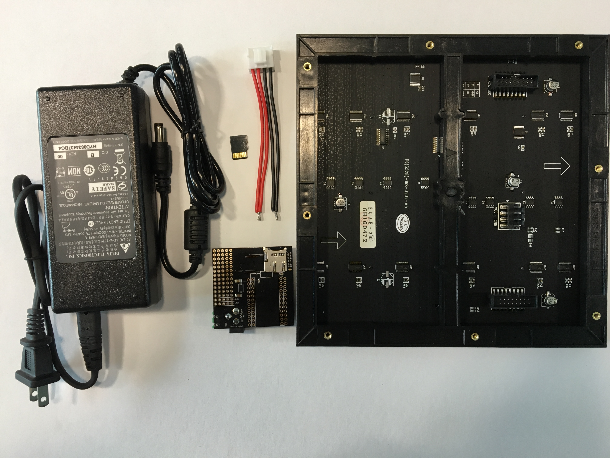
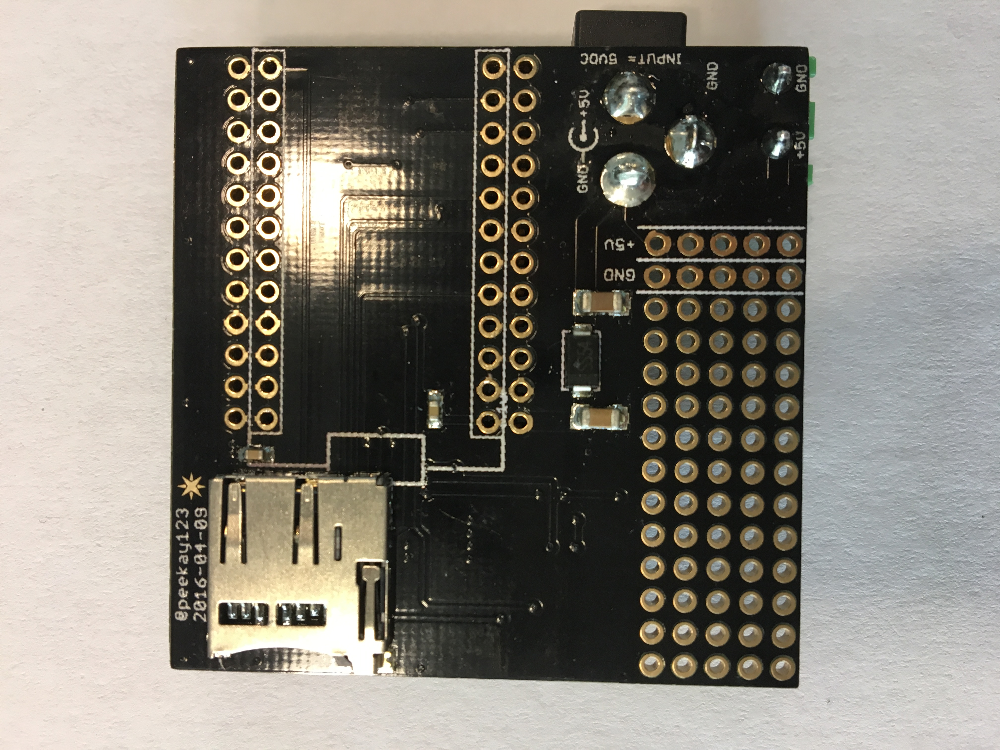
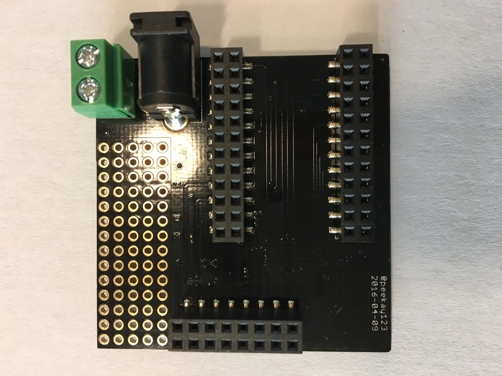
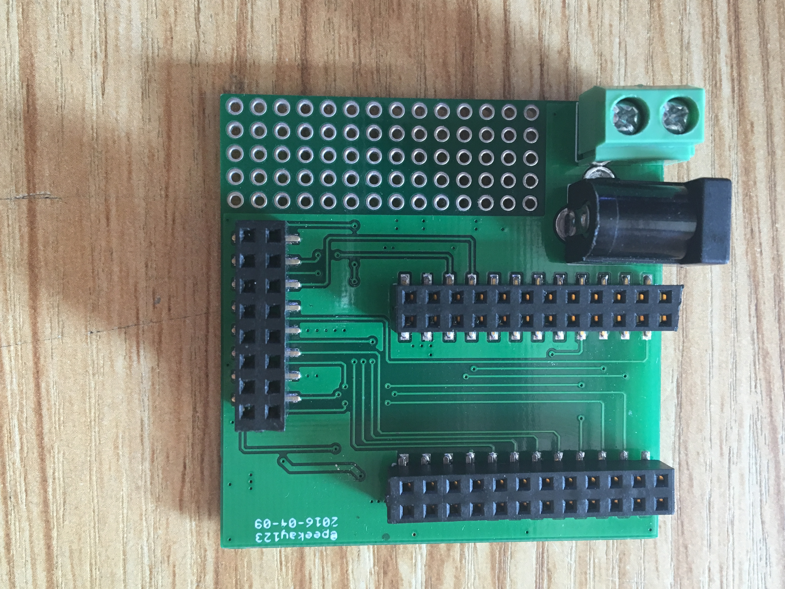
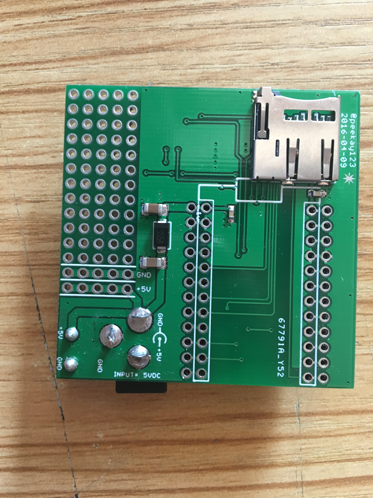
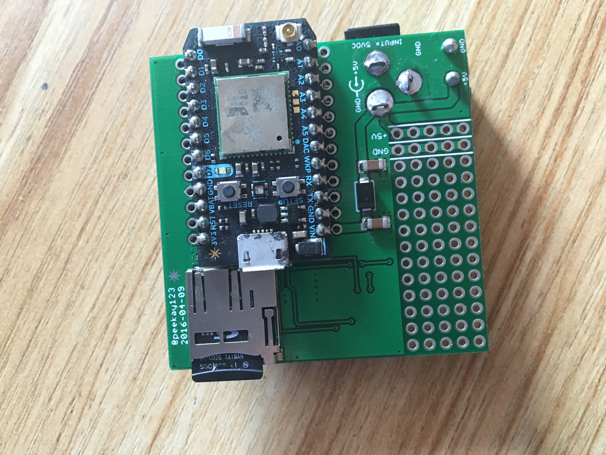
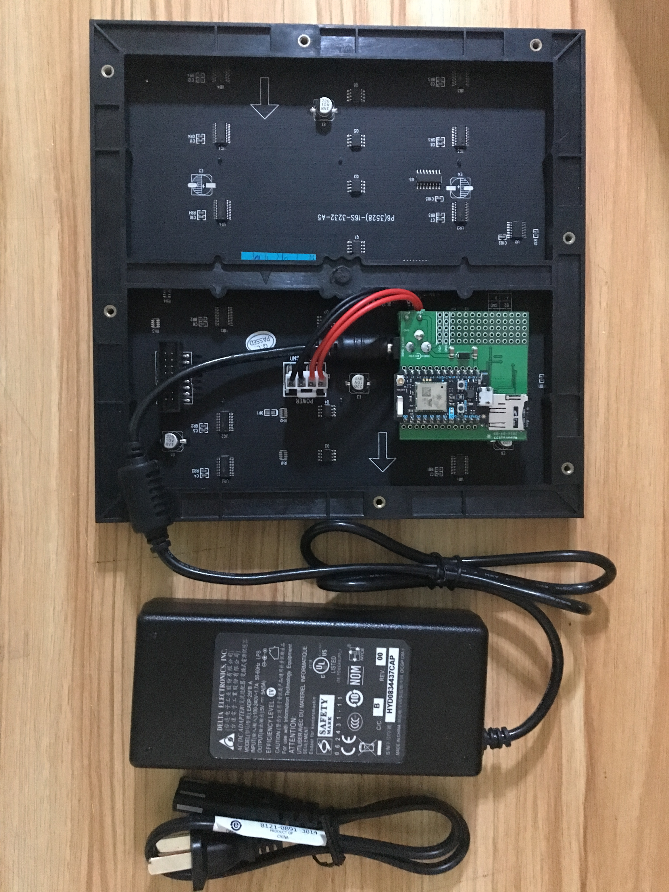

# RGB Pixel Clock Kit

### Introduction

The RGB Pixel Clock is based on the latest (v4) version of the RGB Matrix Shield designed by @peekay123.  The shield allows a Particle Photon or Electron to interface directly with one or two (daisy chained) 32x32 RGB Matrix panels to display color images and text.  An onboard microSD socket allows images and files to be accessed from the Particle device to display, for example, animated GIF files and images on the RGB panel.  The RGB shield conveniently plugs directly into the back of the RGB Panel for a nice low-profile fit.

NOTE: The kit is not compatible with the older Spark Core.

### Parts List
You kit includes the following components:

 - 32x32 RGB Display Panel
 - Display power plug
 - RGB Shield
 - DC Power Supply
 - microSD card (blank)

NOT included in the kit but required:
 - Particle Photon or Electron

### Assembly Guide

If a new unconfigured Photon or Electron is used, the following startup guides are recommended:

Photon - https://docs.particle.io/guide/getting-started/intro/photon/
Electron - https://docs.particle.io/guide/getting-started/intro/electron/

#The RGB Matrix Shield
The small board provided with the kit is the RGB Matrix Shield, as shown in these top and bottom views:

which needs to be assembled first.   

(add pictures and descriptions)

### Setup (programming guide)

### Troubleshooting

Link to the community thread.
