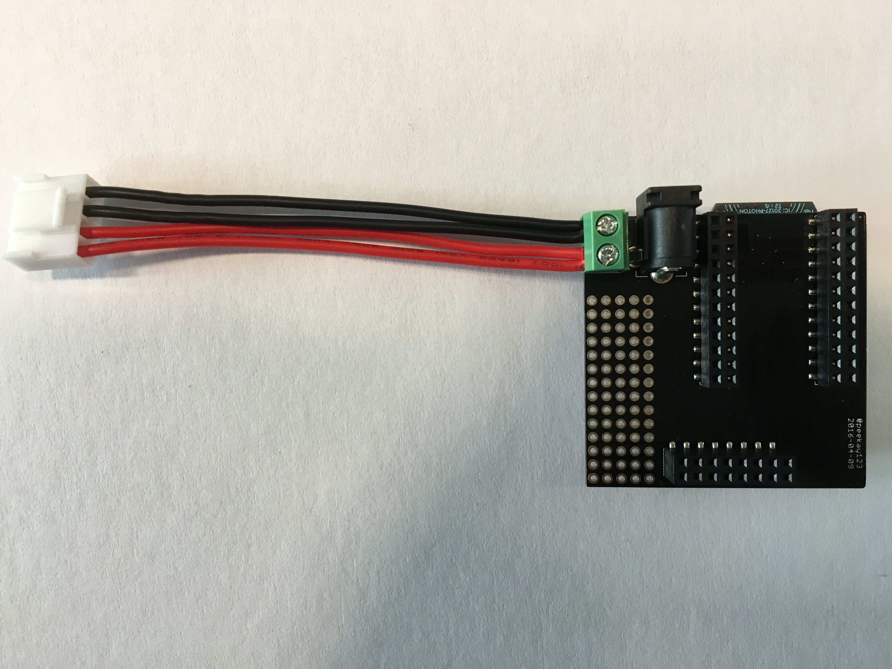
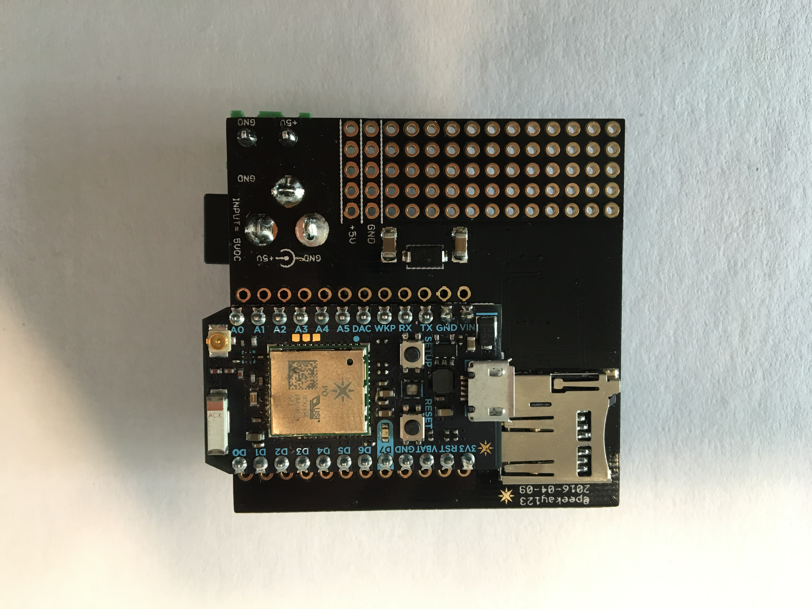
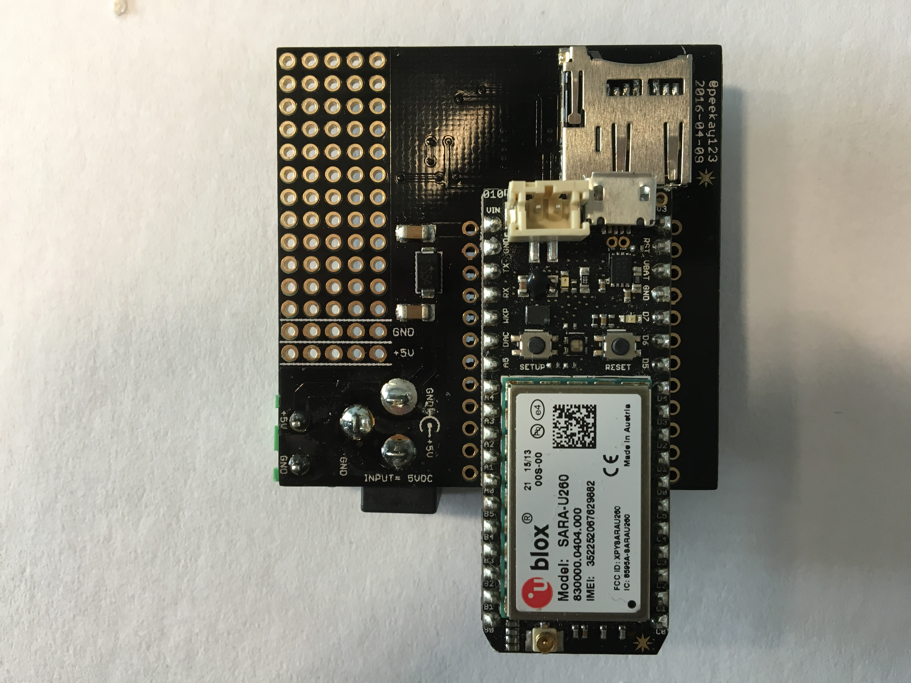
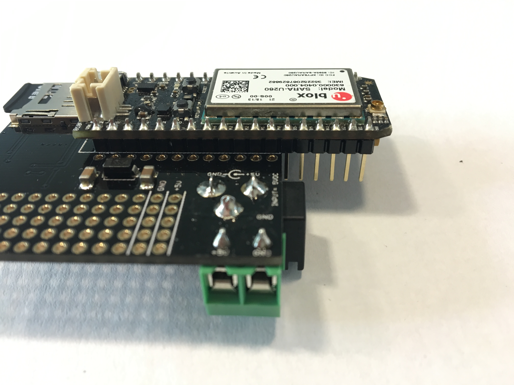
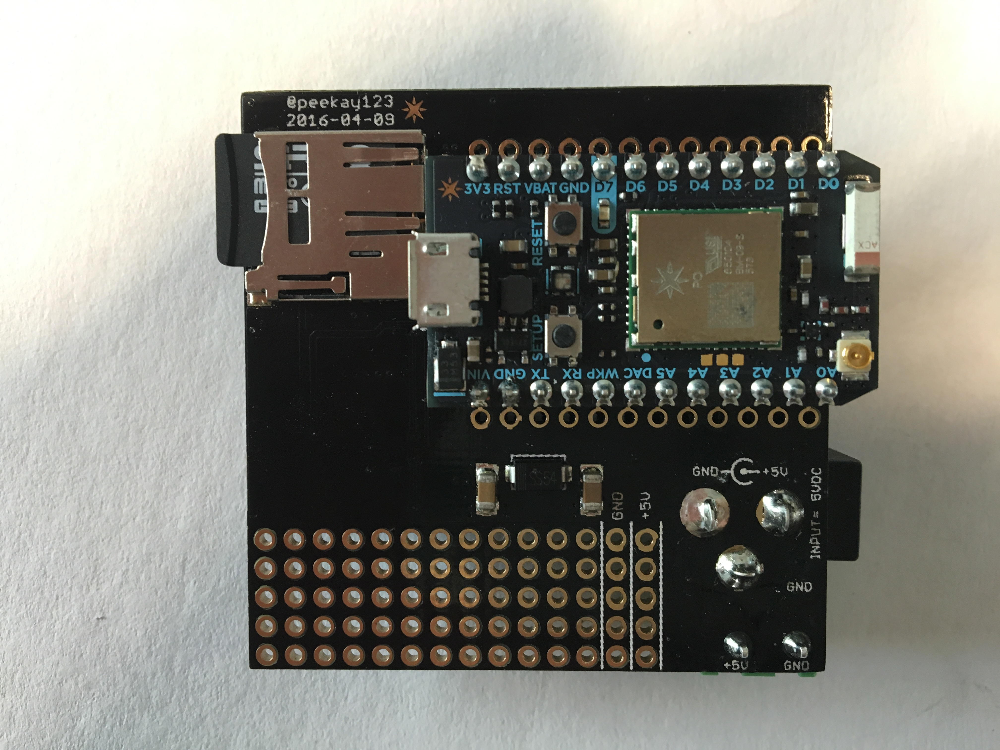
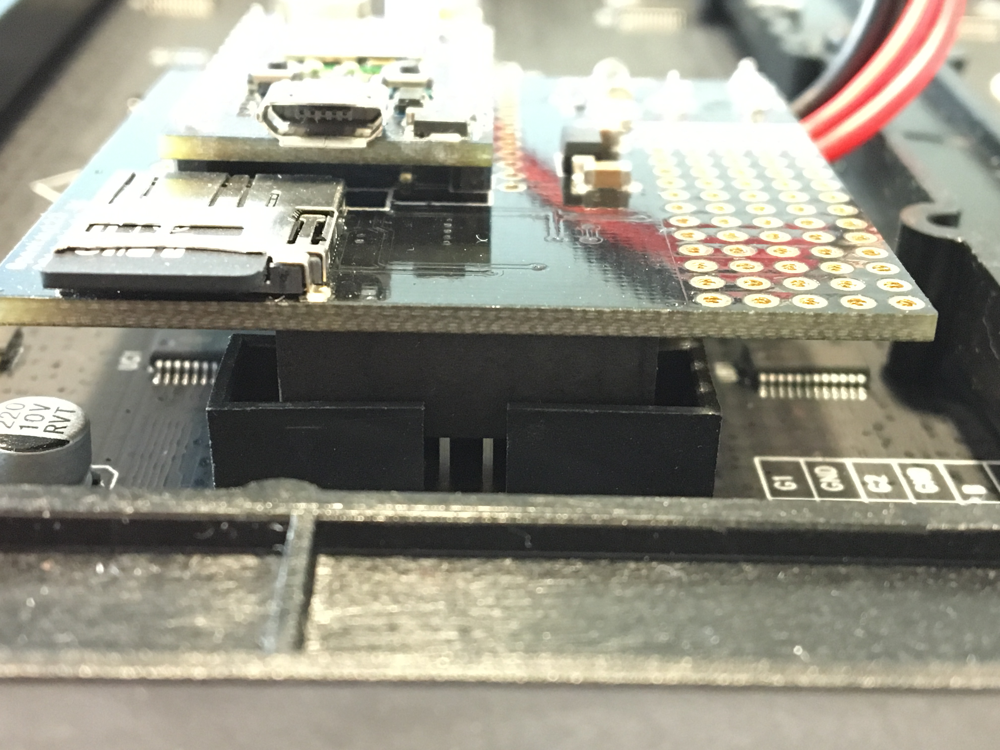
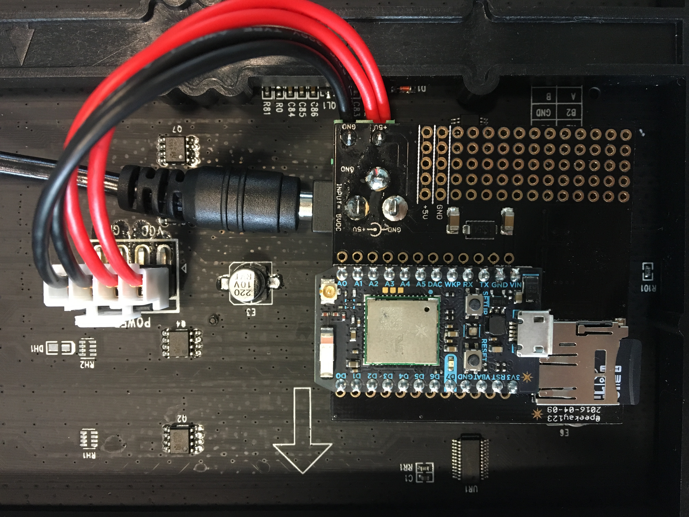

# RGB Pixel Clock Kit

### Introduction

The RGB Pixel Clock is based on the latest (v4) version of the RGB Matrix Shield designed by @peekay123.  The shield allows a Particle Photon or Electron to interface directly with one or two (daisy chained) 32x32 RGB Matrix panels to display color images and text.  An onboard microSD socket allows images and files to be accessed from the Particle device to display, for example, animated GIF files and images on the RGB panel.  The RGB shield conveniently plugs directly into the back of the RGB Panel, providing a low-profile fit.

**NOTE**: The kit is not compatible with the older Spark Core.

The RGB Pixel Clock Kit can be used stand-alone with several community-created libraries (eg. RGB Pong Clock) and is included in the [Word Clock (kit)](http://github.com/spark/wordclock) featured for the first time at the San Francisco 2016 Maker Faire.  

### Parts List
You kit includes the following components:

 - 32x32 RGB Display Panel
 - RGB Shield
 - Shield to panel power plug
 - DC Power Supply
 - microSD card (blank)

*NOT* included in the kit but required:
 - Particle Photon or Electron

### Assembly Guide

If a new unconfigured Photon or Electron is used, the following startup guides are recommended:

Photon - https://docs.particle.io/guide/getting-started/intro/photon/

Electron - https://docs.particle.io/guide/getting-started/intro/electron/

#The RGB Matrix Shield
The small board provided with the kit is the RGB Matrix Shield, as shown in these top and bottom views:

1. Assemble the shield-to-panel power plug by inserting both red wires into the "+" terminal of the screw terminal and tighening the screw to secure the wires.  Do the same with the black wires, inserting them into the "GND" terminal.  The completed assembly looks as follows:
  
  
  
2. Insert a Photon or Electron into the shield, making sure the USB connector is next to the microSD socket as shown below:
  
  
  
  
  **NOTE**: The Electron is longer than the shield board and some of its pins will "dangle" beyond the edged.  This is normal:
  
  
  
3. Next, insert the provided microSD card into the socket.
  **IMPORTANT:  The microSD socket's card-detect hardware conflicts with the shield's normal operation if a microSD card is not inserted.  As such, a microSD MUST be inserted even if not used.**
  
  
  
4. Next, plug the RGB shield into the INPUT connector of the  RGB panel.  There are two connectors on the panel - an INPUT, identified as the one with the connector legend next to it, and an OUPUT, which is used to daisy chain (with an appropriate ribbon cable not supplied) to the INPUT of a second panel.
  
  *IMPORTANT*: The RGB shield connector (underside of board) must be centered on the RGB panel receiving connector, as shown below:
  
  
  
5. Next, plug the shield power connector into the RGB panel power connector as shown below.
  
  
  
6. Finally, the shield and panel is powered by inserting the power supply connector into the barrel jack on the underside of the RGB shield.  Final assembly is shown below:
  
  
  
**NOTE**: The RGB Shield includes a small prototyping area with adjacent +5v and GND rails.

### Setup (programming guide)

The RGB Matrix Shield requires the [RGBMatrixPanel](https://github.com/pkourany/RGBmatrixPanel_IDE) library to function.  It can also be found [on the Web IDE](https://build.particle.io/libs/573f6d77cbc9f2b851000e04/tab/RGBmatrixPanel.cpp).

On great way to use you RGB panel is to flash the RGBPixelClock app that can be found on the [Particle Web IDE](https://docs.particle.io/guide/getting-started/build/photon/#web-ide).  You will need to attach other libraries to the app for it to compile so new users should become familiar with the Web IDE and adding libraries.

To complete the RGB Pixel Clock kit and to flash   [RGBPixelClock](https://build.particle.io/libs/573f856ccbc9f2c1f30011f1/tab/1_RGBPongClock.ino) to your Particle device via Particle Web IDE or get the code on [github](https://github.com/pkourany/RGBPixelClock_IDE). However, the kit may also be used with the community supplied [Live Sports Scoreboard](https://community.particle.io/t/live-sports-scoreboard/19817) app.  Please feel free to use these or create your own to contribute back to the community!

### Troubleshooting

- Ensure the Particle device is completely inserted into the RGB shield
- Ensure the power connector (with red/black wires) is correctly connected to the screw terminals with red wires to "+" and black wires to "GND"
- Ensure the RGB shield connector is correctly centered when inserted into the RGB panel connector

Link to the community thread.
