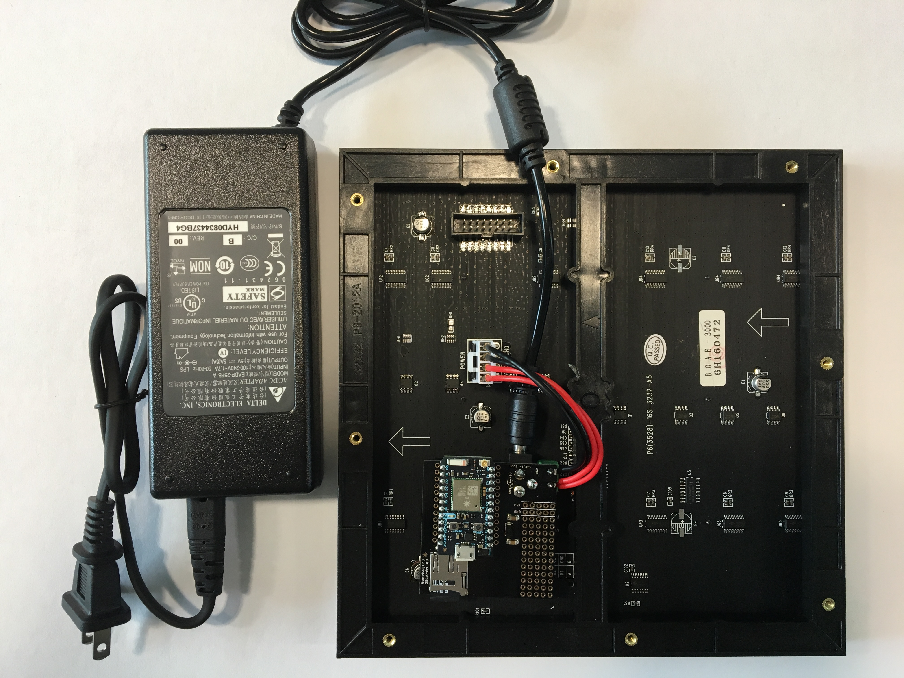

# RGB Pixel Clock

### Introdcutions

### Parts List
You kit includes the following components:

 - 32x32 RGB Display Panel
 - Display power plug
 - RGB Shield
 - DC Power Supply
 - microSD card (blank)

### Assembly Guide
(add pictures and descriptions)

### Setup (programming guide)

### Troubleshooting

Link to the community thread.
